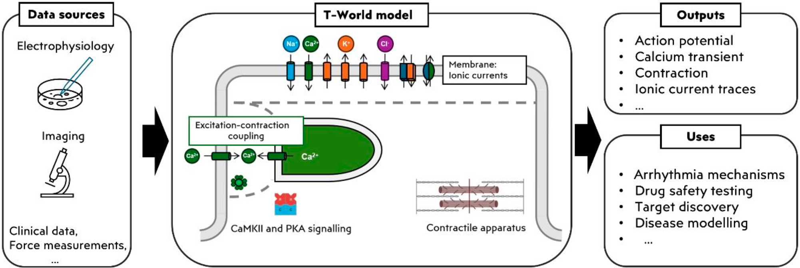

# T-World Online

A web app for running and interacting with simulations of [T-world](https://elifesciences.org/articles/48890), a state-of-the-art computational model for a human ventricular myocyte.



## Table of Contents
- [Overview](#overview)
- [Getting Started](#getting-started)
- [Stimulation Protocols](#stimulation-protocols)
- [Online Limits](#online-limits)
- [Parameter Controls](#parameter-controls)
- [Plotting Window](#plotting-window)
- [Exporting Data](#exporting-data)
- [Offline Access: Installation Instructions](#offline-access-installation-instructions)
- [Troubleshooting](#troubleshooting)
- [Feedback](#feedback)
- [License](#license)
- [Acknowledgements](#acknowledgements)


## Overview
Welcome to **T-World Online**! 
This web application accompanies [T-world](https://www.biorxiv.org/content/10.1101/2025.03.24.645031v1)—a state-of-the-art computational model of the human ventricular cardiomyocyte. It allows users to simulate the T-World model using a range of stimulation protocols and visualize the outputs. We hope it serves as a valuable tool for both educators and researchers.


## Getting Started
0. Head over to [https://t-world-simulator-multipage-production.up.railway.app/](https://t-world-simulator-multipage-production.up.railway.app/)
1. Select a pacing protocol from the top navigation bar.
2. Set the desired parameters for the pacing protocol and model using the controls on the left.
3. Choose variables to plot using the dropdown menu above the plotting window.
4. Click the green Run button. A loading ring will appear—your plot will display when it's done.


## Stimulation Protocols
### Periodic Pacing
- Standard, fixed-rate pacing.
- Configure pacing frequency, number of beats, and how many final beats to display.

### S1-S2 Restitution
- A sequence of regular stimuli (S1) followed by a single extra stimulus (S2) at varying intervals.
- Useful for constructing restitution curves (APD vs. DI).
- Enter ranges in the format min:max:increment (e.g., 300:500:50 → [300, 350, 400, 450]).
- Multiple ranges can be comma-separated.
- APD and DI are computed at 90% repolarization.
- Upper plot: final two beats per S2 interval; lower plot: restitution curve.

### Rate Dependence and Alternans
- Fixed-rate pacing over a range of cycle lengths.
- Investigate APD and CaT dependence on pacing frequency and check for alternans.
- Upper plot: last 4 APs for each pacing frequency; lower plot: APD and CaT amplitude vs. basic cycle length.

### Delayed Afterdepolarizations (DADs)
- Fixed-rate pacing followed by quiescence.
- Configure the number of beats and the quiescence duration to study DAD behavior.


## Online Limits
Due to limited compute resources, the online version imposes:
- Max pre-pacing beats: **500**
- Max S2 intervals: **50**
- Max basic cycle lengths: **20**

Running the app offline removes these limits.

## Parameter Controls
Located on the left of the app, these allow configuration via sliders, dropdowns, and input fields. Invalid inputs highlight red. Users can:
- Choose from three cell types: *endocardium*, *epicardium*, *midmyocardium*.
- Select a preset: *default*, *EAD prone*, *alternans with low SERCA*, *DAD prone*.
- Adjust current multipliers.
- Set extracellular concentrations.
- Modify β-adrenergic signaling (β-ARS) via phosphorylation levels.

## Plotting Window
- Use dropdowns and tabs to select output variables.
- Note: rerun the simulation when new variables are selected.
- Click-and-drag to zoom; double-click to reset axes.
- Navigation tools appear in the top-right corner of the plot.


## Exporting Data
After running a simulation, click the Save data button to export the simulation and parameters as CSV files.


## Offline access - Installation instructions

#### 1. Ensure you have Python (≥3.x) installed
This can be verified by opening Termianl (MacOS/Linus) or Command Prompt (Windows) and typing
```bash
python --version
```

#### 2. Clone the repository
```
git clone https://github.com/ThomasMBury/t-world-simulator-multipage.git
cd t-world-simulator-multipage
```
#### 3. Set up a virtual environment (recommended)
**MacOS/Linus:**
```
python -m venv venv
source venv/bin/activate
```
**Windows:**
```
python -m venv venv
.\venv\Scripts\activate
```

#### 4. Install dependencies
```
pip install --upgrade pip
pip install -r requirements.txt
```

#### 5. Run the app
```
python app.py
```
Then, open a browser and go to http://127.0.0.1:8050/ to view the app.


## Troubleshooting
- If unresponsive, refresh your browser.
- Use a modern browser (Chrome, Firefox, Edge, Safari).
- For slow performance, consider installing the app locally.

## Feedback
Encounter an issue? Please submit it through [GitHub Issues](https://github.com/ThomasMBury/t-world-simulator-multipage/issues).

## License
This project is licensed under the [MIT License](https://github.com/ThomasMBury/t-world-simulator-multipage/blob/main/LICENSE).

## Acknowledgements
The app is built using Dash and simulations are run using myokit.
- TMB is supported by the FRQNT postdoctoral fellowship (314100). 
- JT is supported by the Sir Henry Wellcome Fellowship (222781/Z/21/Z).
