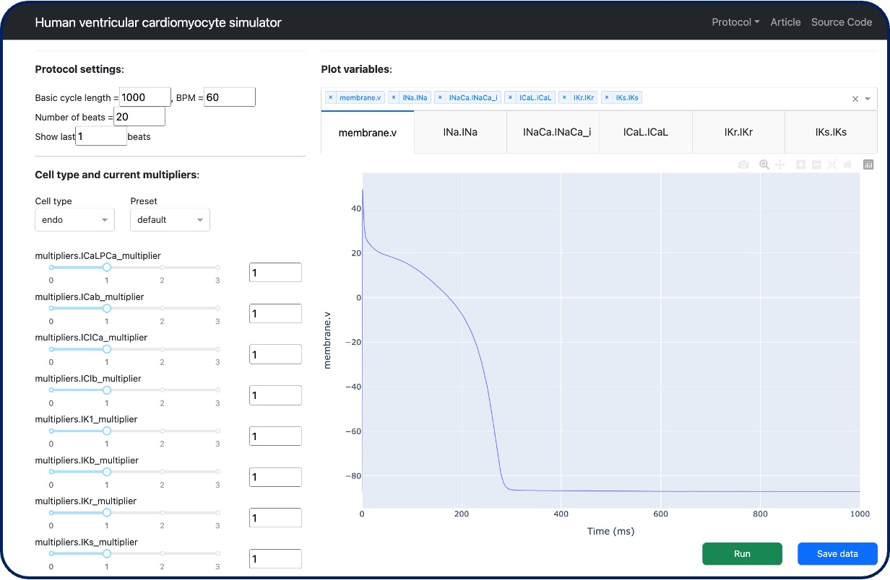

# T-World Simulator

A web app for running and interacting with simulations of [T-world](https://elifesciences.org/articles/48890), a state-of-the-art computational model for a human ventricular myocyte.



## Table of Contents
1. [Overview](#overview)
2. [Features](#features)
3. [Installation](#installation)
   - [Online Access](#online-access)
   - [Offline Access - Installation Instructions](#offline-access---installation-instructions)
4. [Tips for Use](#usage)
5. [License](#license)
6. [Feedback](#feedback)


## Overview
Welcome to **T-World Simulator**! 
This web application accompanies [T-world](https://elifesciences.org/articles/48890)---a state-of-the-art computational model for a human ventricular myocyte.
It provides an interface for exploring different stimulation protocols, visualizing membrane voltage and conduction traces, and experimenting with model parameters.
We hope it serves as a valuable tool for both educators and researchers.

## Features:
- **Stimulation Protocols**:
  - Regular pacing
  - S1-S2 pacing
  - Pacing at multiple rates
  - Pacing followed by a pause
- **Parameter Variations**:
  - Channel conductances
  - Extracellular concentrations
  - Phosphorylation levels
- **Visualizations**
  - Voltage and conduction traces
  - Restitution curves
- **Data Export**
  - Download simulation results and parameter configurations in CSV format.

The app is built on top of [Plotly Dash](https://dash.plotly.com/) and [myokit](https://www.myokit.org/).

## Installation

### Online access
You can access T-World Simulator online without installation at:
[https://t-world.up.railway.app/](https://t-world.up.railway.app/)

Limitations on the online version:
- **Maximum number of pre-pacing beats**: 500
- **Maximum number of S2 interval values**: 50
- **Maximum number of basic cycle length values**: 50

These limitations are not imposed on the offline version. 

### Offline access - Installation instructions

#### 1. Ensure you have Python (≥3.x) installed
This can be verified by opening Termianl (MacOS/Linus) or Command Prompt (Windows) and typing
```bash
python --version
```

#### 2. Clone the repository
```
git clone https://github.com/ThomasMBury/t-world-simulator.git
cd t-world-simulator
```
#### 3. Set up a virtual environment (recommended)
**MacOS/Linus:**
```
python -m venv venv
source venv/bin/activate
```
**Windows:**
```
python -m venv venv
.\venv\Scripts\activate
```

#### 4. Install dependencies
```
pip install --upgrade pip
pip install -r requirements.txt
```

#### 5. Run the app that uses regularly spaced stimulation
```
cd app_reg_stim
python app.py
```
Then, open a browser and go to http://127.0.0.1:8050/ to view the app.


#### 6. Run a different stimulation protocol
Each stimulation protocol has its own app. To run a different protocol, terminate the current app in the Terminal with Control+C. Then, navigate the appropriate directory and run the app as before. For example, to run the S1-S2 protocol app, enter
```
cd ../app_s1_s2
python app.py
```
and refresh the browser at http://127.0.0.1:8050/.

## Usage

### Tips

1. **Basic Interactions:**
- Adjust **sliders** and **dropdown menus** on the left side of the app to modify parameters.
- Click the **green Run button** to start the simulation.
- When the simulation is running, a **loading ring** will appear next to the Run button to indicate progress.

2. **Visualization panel**
 - The panel displays the **membrane voltage** by default.
 - **Switch between tabs** at the top to view traces of other variables.
 - Use the dropdown menu to add additional variables to the tabs. Note that you’ll need to re-run the simulation to visualize these new variables.

3. **Plotly Functions**
- **Zoom and Pan:** Use the tools in the top-right corner of the visualization to zoom in, zoom out, or pan across the plot.
- **Toggle Traces:** For plots with multiple traces, click on any legend item to show or hide that specific trace. Double-click a legend item to isolate it by turning off all other traces.
- **Hover for Details:** Move your cursor over a trace to view information about the values at specific points.

4. **Refreshing the Page:**
 - If the app seems unresponsive, try refreshing the page in your browser.

5. **Exporting Data:**
 - Click the **blue Save button** to download CSV files containing the simulation results and the current parameter settings.

6. **Browser Compatibility:**
 - The app works best in modern browsers like Google Chrome, Mozilla Firefox, Microsoft Edge, or Safari.


### Details on stimulation protocols

#### Regular Stimulation
Periodic pacing.

#### S1-S2
Designed to construct the restitution curve.

#### Multiple rates
Designed to construct a bifurcaiton diagram and test for **alternans**.

#### Stimulate and pause
Designed to test for **delayed afterdepolarizations**. By default all phosphorylation on.

## License
This project is licensed under the MIT License - see the [LICENSE](LICENSE) file for details.

## Feedback

If you encounter any issues, please post a [GitHub Issue](https://github.com/ThomasMBury/ap-simulator/issues).

---

